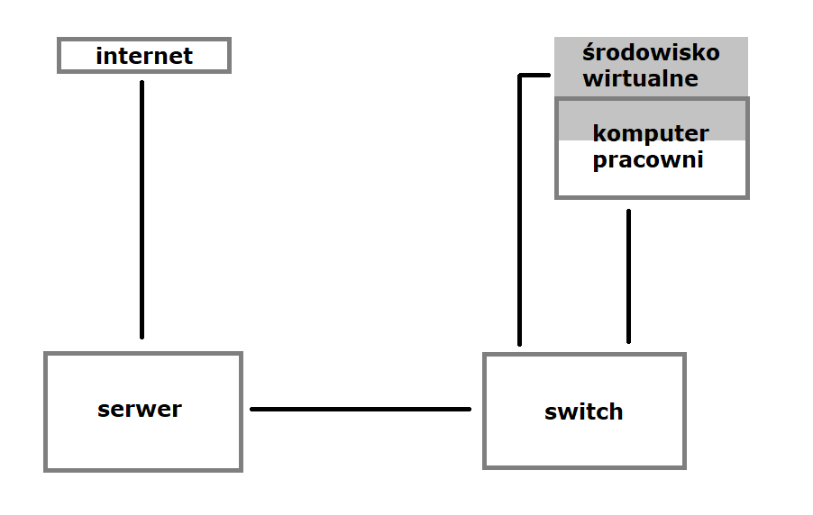

System operacyjny w środowisku sieciowym
=========================================

Charakterystyka systemu operacyjnego
------------------------------------

| Charakterystyka | wartość           | komentarz |
| ------------- |:-------------:| -----:|
| nazwa      | linux | centos 7 minimal |
| program (parametry sieci)      | terminal |  |

Konfiguracja połączenia sieciowego
----------------------------------

| Parametr | wartość           | komentarz |
| ------------- |:-------------:| -----:|
| Adres IP      | 10.0.2.15 | przydzielony przez DHCP |
| Maska podsieci      | 24 | 11000b |
| Brama      | 10.0.2.2 |  |
| DNS 1      | 10.10.0.8 |  |
| DNS 2      | 10.10.0.4 |  |

Schemat sieci
------------- 

