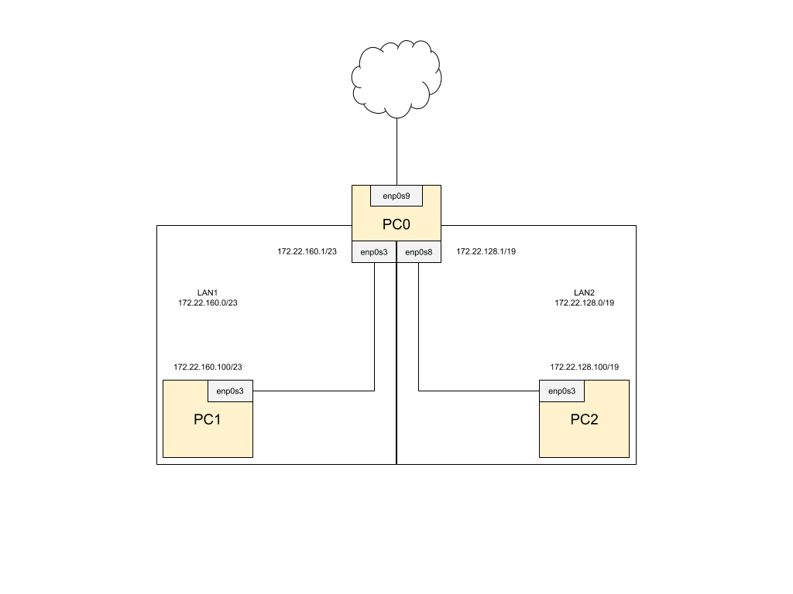

Zadanie 1
---------

1. Zaprojektuj oraz przygotuj prototyp rozwiązania z wykorzystaniem oprogramowania ``VirtualBox`` lub podobnego. 
Zaproponuj rozwiązanie spełniające poniższe wymagania:
   * Usługodawca zapewnia domunikację z siecią internet poprzez interfejs ``eth0`` ``PC0``
   * Zapewnij komunikację z siecią internet na poziomie ``LAN1`` oraz ``LAN2``
   * Dokonaj takiego podziału sieci o adresie ``172.22.128.0/17`` aby w ``LAN1`` można było zaadresować ``500`` adresów natomiast w LAN2 ``5000`` adresów    
   * Przygotuj dokumentację powyższej architektury w formie graficznej w programie ``DIA``
 
---------
**Rozwiązanie**

Konfiguracja sieci:
1. LAN1 - ``172.22.160.0/23``
2. LAN2 - ``172.22.128.0/19``

Konfiguracja maszyn wirtualnych:
1. PC0
    * enp0s3 - ``172.22.160.1/23``
    * enp0s8 - ``172.22.128.1/19``
    * enp0s9 - ustalone przez DHCP (NAT)
2. PC1
    * enp0s3 - ``172.22.160.100/23``
3. PC2
    * enp0s3 - ``172.22.128.100/19``
  
